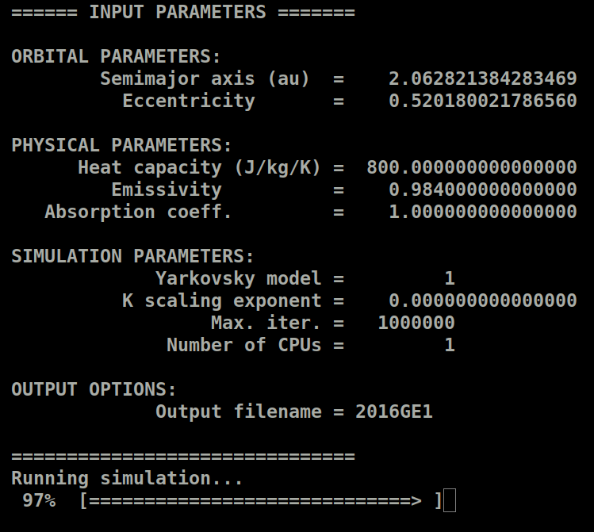

# Manual for the D-NEAs software

## Table of contents

* [Introduction](#introduction)
* [Compilation](#compilation)
* [Thermal inertia estimation](#thermal-inertia-estimation)
* [License and authors](#license-and-authors)
* [References](#references)

## Introduction

This software was developed for the D-NEAs project, that was awarded with the [Planetary Society STEP grant 2021](https://www.planetary.org/articles/step-grant-winners-2022). 
This package contains a software implementing a method for the thermal inertia estimation of near-Earth asteroids (NEAs), 
that based on the measurements of the Yarkovsky effect by astrometry. Original results based on this code are 
published in the papers XXX, YYY, ZZZ.

The software is written as a combination of FORTRAN, python, and bash scripting. The main executable for the thermal 
inertia estimation is called

            gamma_est_mc.x 

The user can find the mathematical details of the model in the paper WWW.

## Compilation

The code is structured into the following folders:
-    **src**: contains the source codes
-    **bin**: contains the binary files of the executables
-  **input**: contains the input files of the executables
- **output**: contains the output files
- **matlab**: contains scripts and functions to produce input and output
-   **.mod**: contains the .mod files needed at compilation time
-   **.obj**: contains the .o files needed at compilation time

Before using the package for the first time, the code needs to be compiled. To facilitate the user, the distribution
comes with a configuration script and a Makefile that automatically does the job. To compile the source code, 
please follow these steps
1. Choose the compiler and the compilation options by running the config.sh script. By running the script without further options, you will receive an help message. The script permits to choose between two different compiler: GNU gfortran, and Intel ifort. An additional option defines the compilation flags, and the final user can select the optimization flags "-O". For instance, if you want to use the GNU gfortran compiler, you can run the script as
           
           ./config.sh -O gfortran
            
2. Run the Makefile to compile the source code. To this purpose, you can type

            make

   and the executable binary files will be placed in the *bin* directory. Symbolic links will be created in the main directory.

**NOTE 1.** The code has been tested with the Intel ifort compiler v. 2021.3.0, and with the GNU gfortran compiler v. 9.4.0. Note that the -qopenmp flag is not available in the Intel ifort versions previous to the 2018.0.0, and therefore the compilation may not work. 

**NOTE 2.** In our runs, we found that the code is significantly faster when compiled with the [Intel ifort compiler](https://www.intel.com/content/www/us/en/developer/tools/oneapi/fortran-compiler.html#gs.9x3c16) rather than with the GNU gfortran compiler. We suggest the user to compile the code whit the Intel ifort compiler in order to obtain the best performances.

**NOTE 3.** For the compilation to work correctly, you need two hidden directories called *.mod* and *.obj*. Please be sure that these two directories are correctly contained on your local distribution.
to use the Intel ifort compiler, that is now freely available. 

## Thermal inertia estimation 

The program gamma_est_mc.x for the thermal inertia estimation has two kinds of input:

1. files containing the distributions of physical parameters
2. a configuration file containing the fixed physical parameters and the settings for the run

In the next sections we explain how to produce the input files, how to run the code, and what are the output files of the code.

### Distributions of physical parameters 

Some parameters of the Yarkovsky model can be assumed to have a certain distribution. In our model, we assume that the measured Yarkovsky effect, 
the bulk and the surface density, the diameter, the obliquity, and the rotation period may all be represented by a distribution.
The program needs the following files, to be placed in the *input* folder:

- **dadt_mc.txt**: contains the distribution of the measured Yarkovsky effect;
- **rho_mc.txt**: contains the distribution of the bulk density of the asteroid;
- **rho_surf_mc.txt**: contains the distribution of the surface density. This file is needed only when the two-layer Yarkovsky model is used;
- **diam_mc.txt**: contains the distribution of the diameter of the asteroid;
- **gamma_mc.txt**: contains the distribution of the obliquity of the asteroid;
- **period_mc.txt**: contains the distribution of the rotation period of the asteroid.

WRITE HOW TO GENERATE THE DISTRIBUTIONS WHEN THE PYTHON PART IS READY.

### Configuration file for the main program

The program gamma_est_mc.x also needs a configuration file called *gamma_est_mc.nml*, to be placed in the folder *input*. 
In this file the user must provide:

- **C**: the value of the heat capacity C (in J/kg/K).
- **thermalCondMin**, **thermalCondMax**:the minimum and maximum values of thermal conductivity K (in W/m/K) in which solutions of the measured vs. predicted Yarkovsky drift equations are searched for.
- **semiaxm**: the semi-major axis of the asteroid orbit (in au).
- **ecc**: the eccentricity of the asteroid orbit.
- **absCoeff**: the absorption coefficient of the asteroid.
- **emissiv**: the emissivity of the asteroid.
- **method**: the model used for the prediction of the Yarkovsky drift. Currently available options are:
   * 1: Analytical circular model - single layer;
   * 2: Semi-analytical eccentric model - single layer;
   * 3: Semi-analytical eccentric model - double layer.
- **filename**: the name to give to the output files.
- **max_iter**: the maximum number of iterations of the Monte Carlo method.
- **expo**: the exponent for the thermal inertia variation along the orbit. Note that if this flag is assigned the value 0.d0, then a constant thermal inertia is used.
- **n_proc**: number of processors used for the Monte Carlo method. Parallelization is implemented by using the FORTRAN [OpenMP](https://www.openmp.org/) API.

The input file will look like the following figure
<figure>

</figure>

### Running the thermal inertia estimation 

Once all the input files are ready, you can run the Monte Carlo estimation of the thermal inertia by typing

           ./gamma_est_mc.x

from the main directory. The program will print on the screen a summary of the options used in input, and show a 
progress-bar only when 1 CPU is used for the simulation. 
<figure>

</figure>

### Output files

The program creates three output files will be produced and placed in the *output* folder:

**\<filename\>.txt**: this is the general output file, which is organized in columns. The first row of the file specifies what values are on each column. For the single layer model,
the user will find:
   1. the thermal conductivity (in W/m/K); 
   2. the corresponding thermal inertia (in J m$^{-2}$ K$^{-1}$ s$^{-1/2}$);
   3. the bulk density (in kg/m$^{3}$);
   4. the diameter (in m);
   5. the obliquity (in degrees);
   6. the seasonal wave depth (in m);
   7. the diurnal wave depth (in m).
In the case the two-layer Yarkovsky model is used, the surface density is added in the fourth column, while the other values are shifted by one column to the right.

**\<filename\>.warn**: this file contains errors and warning messages encountered during the execution of the code. 

**\<filename\>.done**: this file is created when the job has ended correctly, and it is just empty. It is useful to monitor the end which jobs have ended when multiple 
processes are launched simultaneously. 

### Thermal inertia estimation of a set of NEAs 

## Running the test 

## License and authors

The D-NEAs software is released under the XXX license, and it is developed and maintained by

- [Marco Fenucci](http://adams.dm.unipi.it/~fenucci/index.html), Department of Astronomy, Faculty of Mathematics, University of Belgrade (<marco_fenucci@matf.bg.ac.rs>) 
- [Bojan Novaković](http://poincare.matf.bg.ac.rs/~bojan/index_e.html), Department of Astronomy, Faculty of Mathematics, University of Belgrade (<bojan@matf.bg.ac.rs>) 
- [Dušan Marčeta](http://poincare.matf.bg.ac.rs/~dmarceta/), Department of Astronomy, Faculty of Mathematics, University of Belgrade (<dmarceta@matf.bg.ac.rs>) 

## References

- M. Fenucci and B. Novaković: 2022. [*Low thermal conductivity of the super-fast rotator (499998) 2011 PT*](https://ui.adsabs.harvard.edu/link_gateway/2021A&A...647A..61F/doi:10.1051/0004-6361/202039628), Astronomy and Astrophysics 647, A61
