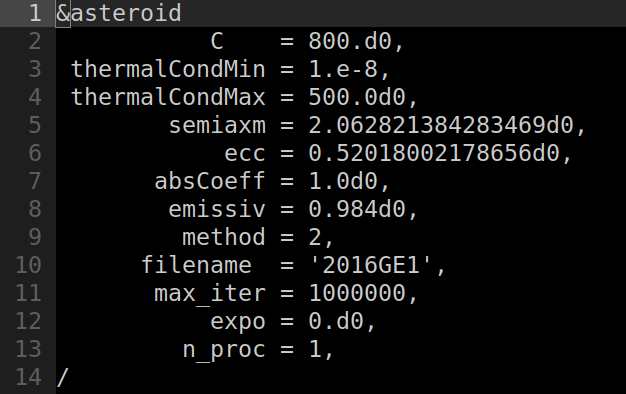

# Manual for the D-NEAs software

## Table of contents

* [Introduction](#introduction)
* [Compilation](#compilation)
* [Thermal inertia estimation](#thermal-inertia-estimation)
* [License and authors](#license-and-authors)
* [References](#references)

## Introduction

This software was developed for the D-NEAs project, that was awarded with the [Planetary Society STEP grant 2021](https://www.planetary.org/articles/step-grant-winners-2022). This package contains a software for the thermal inertia estimation of near-Earth asteroids (NEAs), based on the measurements of the Yarkovsky effect by astrometry. Original results based on this code are published in the papers XXX, YYY, ZZZ.

The executable for the thermal inertia estimation is called

            gamma_est_mc.x 

and mathematical details of the model can be found in the paper WWW.

## Compilation

The code is structured by means of the following folders:
-    src: contains the source codes
-    bin: contains the binary files of the executables
-  input: contains the input files of the executables
- output: contains the output files
- matlab: contains scripts and functions to produce input and output
-   .mod: contains the .mod files needed at compilation time
-   .obj: contains the .o files needed at compilation time

Before using the package for the first time, the code needs to be compiled. To facilitate the user, the distribution
comes with a configuration script and a Makefile that automatically does the job. To compile the source code, 
please follow these steps
1. Choose the compiler and the compilation options by running the config.sh script. By running the script without further options, you will receive an help message. The script permits to choose between two different compiler: GNU gfortran, and Intel ifort. An additional option defines the compilation flags, and the final user can select the optimization flags "-O". For instance, if you want to use the GNU gfortran compiler, you can run the script as
           
           ./config.sh -O gfortran
            
2. Run the Makefile to compile the source code. To this purpose, you can type

            make

   and the executable binary files will be placed in the *bin* directory. Symbolic links will be created in the main directory.

**NOTE 1.** For the compilation to work correctly, you need two hidden directories called *.mod* and *.obj*. Please be sure that these two directories are correctly contained on your local distribution.

## Thermal inertia estimation 

### Generation of the parameter distributions 
Write this part once the Python code is ready

### Configuration file for the main program

The program gamma_est_mc.x also needs a configuration file called *gamma_est_mc.nml*, to be placed in the folder *input*. 
In this file the user must provide:

- **C**: the value of the heat capacity C (in J/kg/K).
- **thermalCondMin**, **thermalCondMax**:the minimum and maximum values of thermal conductivity K (in W/m/K) in which solutions of the measured vs. predicted Yarkovsky drift equations are searched for.
- **semiaxm**: the semi-major axis of the asteroid orbit (in au).
- **ecc**: the eccentricity of the asteroid orbit.
- **absCoeff**: the absorption coefficient of the asteroid.
- **emissiv**: the emissivity of the asteroid.
- **method**: the model used for the prediction of the Yarkovsky drift. Currently available options are:
   * 1: Analytical circular model - single layer;
   * 2: Semi-analytical eccentric model - single layer;
   * 3: Semi-analytical eccentric model - double layer.
- **filename**: the name to give to the output files.
- **max_iter**: the maximum number of iterations of the Monte Carlo method.
- **expo**: the exponent for the thermal inertia variation along the orbit. Note that if this flag is assigned the value 0.d0, then a constant thermal inertia is used.
- **n_proc**: number of processors used for the Monte Carlo method.

The input file will look like the following figure
<figure>

</figure>

### Running the thermal inertia estimation 

### Output files

### Thermal inertia estimation of a set of NEAs 

## License and authors

The D-NEAs software is released under the XXX license, and it is developed and maintained by

- [Marco Fenucci](http://adams.dm.unipi.it/~fenucci/index.html), Department of Astronomy, Faculty of Mathematics, University of Belgrade (<marco_fenucci@matf.bg.ac.rs>) 
- [Bojan Novaković](http://poincare.matf.bg.ac.rs/~bojan/index_e.html), Department of Astronomy, Faculty of Mathematics, University of Belgrade (<bojan@matf.bg.ac.rs>) 
- [Dušan Marčeta](http://poincare.matf.bg.ac.rs/~dmarceta/), Department of Astronomy, Faculty of Mathematics, University of Belgrade (<dmarceta@matf.bg.ac.rs>) 

## References

- M. Fenucci and B. Novaković: 2022. [*Low thermal conductivity of the super-fast rotator (499998) 2011 PT*](https://ui.adsabs.harvard.edu/link_gateway/2021A&A...647A..61F/doi:10.1051/0004-6361/202039628), Astronomy and Astrophysics 647, A61
