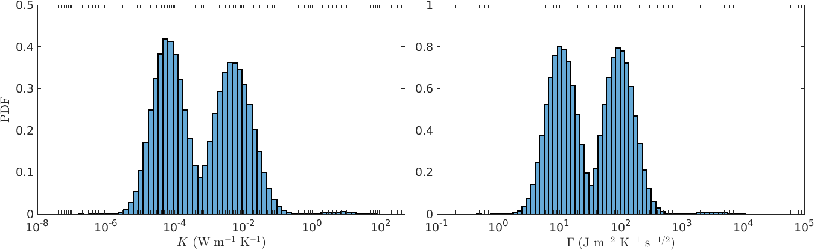

# Manual for the Asteroid Thermal Inertia Analyzer (ASTERIA) software

## Table of contents

* [Introduction](#introduction)
* [Compilation](#compilation)
* [Thermal inertia estimation](#thermal-inertia-estimation)
  + [Distributions of physical parameters](#distributions-of-physical-parameters)
  + [Configuration file for the main program](#configuration-file-for-the-main-program)
  + [Running the thermal inertia estimation](#running-the-thermal-inertia-estimation)
  + [Output files](#output-files)
  + [Running the test](#running-the-test)
* [License and authors](#license-and-authors)
* [References](#references)

## Introduction

The Asteroid Thermal Inertia Analyzer (ASTERIA) software has been developed under the [D-NEAs project](http://asteroids.matf.bg.ac.rs/fam/dneas/website/en/index.html), that was awarded with the [Planetary Society STEP Grant 2021](https://www.planetary.org/articles/step-grant-winners-2022). 
This package contains a software implementing a method for the thermal inertia estimation of near-Earth asteroids (NEAs), 
that is based on the measurements of the Yarkovsky effect obtained by orbit determination. Original results based on this code are 
published in the papers Fenucci et al. 2021, Fenucci et al. 2023.

The software is written in FORTRAN, and the two programs included in this distribution are called
   
            gen_distrib.x

and

            gamma_est_mc.x 

Detailed instructions for the usage of these programs are described below.
The user can find the mathematical details of the model in the paper 

M. Fenucci, B. Novaković, D. Marčeta, and D. Pavela: 2023. *ASTERIA - Asteroid Thermal Inertia Analyzer*

## Compilation

The code is structured into the following folders:
-    **src**: contains the source codes
-    **bin**: contains the binary files of the executables and scripts
-    **dat**: contains data files needed to run the program 
-  **input**: contains the input files of the executables
- **output**: contains the output files
-   **.mod**: contains the .mod files needed at compilation time
-   **.obj**: contains the .o files needed at compilation time

Before using the package for the first time, the code needs to be compiled. To facilitate the user, the distribution
comes with a configuration script and a Makefile that automatically perform the job. To compile the source code, 
please follow these steps:
1. Choose the compiler and the compilation options by running the <tt>config.sh</tt> script. By running the script without further options, you will receive an help message. The script permits to choose between two different compiler: [GNU gfortran](https://gcc.gnu.org/fortran/), and [Intel ifort](https://www.intel.com/content/www/us/en/developer/tools/oneapi/fortran-compiler.html). For the software to be compiler correctly, one of these two compilers need to be installed in your system. An additional option defines the compilation flags, and the final user can select the optimization flags "-O". For instance, if you want to use the GNU gfortran compiler, you can run the script as
           
           ./config.sh -O gfortran
            
2. Run the Makefile to compile the source code. To this purpose, you can type

            make

   and the executable binary files will be placed in the <tt>bin</tt> directory. Symbolic links will be created in the main directory.

**NOTE 1.** The code has been tested with the <tt>Intel ifort compiler v. 2021.3.0</tt>, and with the <tt>GNU gfortran compiler v. 9.4.0</tt>, installed on Ubuntu 20.04 LTS. Note that the <tt>-qopenmp</tt> flag is not available in the Intel ifort versions previous to the 2018.0.0, and therefore the compilation may not work. 

**NOTE 2.** In our runs, we found that the code is significantly faster when compiled with the [Intel ifort compiler](https://www.intel.com/content/www/us/en/developer/tools/oneapi/fortran-compiler.html#gs.9x3c16) rather than with the GNU gfortran compiler. We suggest the user to compile the code whit the Intel ifort compiler in order to obtain the best performances.

**NOTE 3.** For the compilation to work correctly, you need two hidden directories called <tt>.mod</tt> and <tt>.obj</tt>. Please be sure that these two directories are correctly contained on your local distribution.

## Thermal inertia estimation 

The program <tt>gamma_est_mc.x</tt> for the thermal inertia estimation has two kinds of input:

1. files containing the distributions of physical parameters;
2. a configuration file containing the fixed physical parameters and the settings for the run.

In the next sections we explain how to produce the input files, how to run the code, and what are the output files of the code.

### Distributions of physical parameters: <tt>gen_distrib.x</tt>

Some parameters of the Yarkovsky model can be assumed to have a certain distribution. In our model, we assume that the measured Yarkovsky effect, 
the bulk and the surface density, the diameter, the obliquity, and the rotation period may all be represented by a distribution.
The program needs the following files, to be placed in the <tt>input</tt> folder:

- **dadt_mc.txt**: contains the distribution of the measured Yarkovsky effect (in au/My);
- **rho_mc.txt**: contains the distribution of the bulk density of the asteroid (in kg/m3);
- **rho_surf_mc.txt**: contains the distribution of the surface density. This file is needed only when the two-layer Yarkovsky model is used;
- **diam_mc.txt**: contains the distribution of the diameter of the asteroid (in m);
- **gamma_mc.txt**: contains the distribution of the obliquity of the asteroid (in deg);
- **period_mc.txt**: contains the distribution of the rotation period of the asteroid (in hours).
- **alpha_mc.txt**: contains the distribution of the absorption coefficient. 

These files can be either manually created by the user, or generated by using the program <tt>gen_distrib.x</tt>. This driver permits to create the distribution files in two different ways: 1) using a Gaussian distribution with user-defined mean and standard deviation; 2) using the population model described in Fenucci et al. 2023b. The first option is suitable when an estimated value for the corresponding parameter is available. The second option can be used when no information about a certain parameter are available, and the best that can be done is an estimation based on the properties of the whole NEO population.

The <tt>gen_distrib.x</tt> program needs an input file called <tt>gen_distrib.nml</tt> containing the following parameters:

- **max_iter**: dimension of the distribution sample;
- **sma**: semi-major axis of the asteroid orbit (in au);
- **ecc**: eccentricity of the asteroid orbit;
- **inc**: inclination of the asteroid orbit;
- **mean_H**: absolute magnitude of the asteroid;
- **std_H**: error on the absolute magnitude;
- **mean_pv**: albedo - use population model if negative;
- **std_pv**: error on the albedo;
- **mean_rho**: density (in kg/m^3) - use population model if negative;
- **std_rho**: error on the density (in kg/m^3);
- **mean_D**: diameter (in m) - use population model if negative;
- **std_D**: error on the diameter (in m);
- **mean_rhos**: density of the surface material (in kg/m^3);
- **std_rhos**: error in the density of the surface material (in km/m^3);
- **mean_gam**: obliquity (in deg) - use population model if negative;
- **std_gam**: error in obliquity (in deg);
- **mean_P**: rotation period (in h);
- **std_P**: error on the rotation period;
- **mean_dadt**: semi-major axis drift due to the Yarkovsky effect (in au/My);
- **std_dadt**: error in the semi-major axis drift (in au/My);
- **alpha**: absorption coefficient - use population model if negative.

### Thermal inertia estimation: <tt>gamma_est_mc.x</tt>

Once all the distribution files are created, the program <tt>gamma_est_mc.x</tt> also needs a configuration file called <tt>gamma_est_mc.nml</tt>, to be placed in the folder <tt>input</tt>. 
In this file the user must provide:

- **C**: the value of the heat capacity C (in J/kg/K).
- **thermalCondMin**, **thermalCondMax**:the minimum and maximum values of thermal conductivity K (in W/m/K) in which solutions of the measured vs. predicted Yarkovsky drift equations are searched for.
- **semiaxm**: the semi-major axis of the asteroid orbit (in au).
- **ecc**: the eccentricity of the asteroid orbit.
- **absCoeff**: the absorption coefficient of the asteroid.
- **emissiv**: the emissivity of the asteroid.
- **method**: the model used for the prediction of the Yarkovsky drift. Currently available options are:
   * 1: Analytical circular model - single layer;
   * 2: Semi-analytical eccentric model - single layer;
   * 3: Semi-analytical eccentric model - double layer.
- **filename**: the name to give to the output files.
- **max_iter**: the maximum number of iterations of the Monte Carlo method.
- **expo**: the exponent for the thermal inertia variation along the orbit. Note that if this flag is assigned the value 0.d0, then a constant thermal inertia is used.
- **n_proc**: number of processors used for the Monte Carlo method. Parallelization is implemented by using the FORTRAN [OpenMP](https://www.openmp.org/) API.

The input file will look like in the following figure

#### Running the thermal inertia estimation 

Once all the input files are ready, you can run the Monte Carlo estimation of the thermal inertia by typing

           ./gamma_est_mc.x

from the main directory. The program will print on the screen a summary of the options used in input, and show a 
progress-bar only when 1 CPU is used for the simulation. 

#### Output files

The program creates three output files will be produced and placed in the <tt>output</tt> folder:

**\<filename\>.txt**: this is the general output file, which is organized in columns. The first row of the file specifies what values are on each column. For the single layer model,
the user will find:
   1. the thermal conductivity (in W/m/K); 
   2. the corresponding thermal inertia (in J m-2 K-1 s-1/2);
   3. the bulk density (in kg/m3);
   4. the diameter (in m);
   5. the obliquity (in deg);
   6. the seasonal wave depth (in m);
   7. the diurnal wave depth (in m).

In the case the two-layer Yarkovsky model is used, the surface density is added in the fourth column, while the other values are shifted by one column to the right.

**\<filename\>.warn**: this file contains errors and warning messages encountered during the execution of the code. 

**\<filename\>.done**: this file is created when the job has ended correctly, and it is just empty. It is useful to monitor the end which jobs have ended when multiple 
processes are launched simultaneously. 

### Running the test 

The distribution includes a test to reproduce some of the results about the super-fast rotator (499998) 2011 PT, 
published in Fenucci et al. 2021. All the input files for (499998) 2011 PT can be found in the folder

            input/2011PT_test

To run the test, the user must first copy the content of this folder into the <tt>input</tt> folder. This can be done automatically
from the main folder by typing

            make test

The test is set up to run on 1 CPU with the analytical circular model. First, the input files need to be generated by

           ./gen_distrib.x

The thermal inertia estimation can be run by typing

           ./gamma_est_mc.x

Output files will be placed in the <tt>output</tt> folder with the prefix <tt>2011PT</tt>. The file <tt>2011PT.txt</tt> contains 
the distribution of the thermal conductivity (first column), and of the thermal inertia (second column). By plotting the 
histograms of log10 of these values, the user should obtain something similar to the following distributions:

            
## License and authors

The D-NEAs is an open-source software released under the Attribution-NonCommercial-ShareAlike 4.0 International (CC BY-NC-SA 4.0) license, and it is developed and maintained by

- [Marco Fenucci](http://adams.dm.unipi.it/~fenucci/index.html), ESA NEO Coordination Centre (<marco.fenucci@ext.esa.int>) 
- [Bojan Novaković](http://poincare.matf.bg.ac.rs/~bojan/index_e.html), Department of Astronomy, Faculty of Mathematics, University of Belgrade (<bojan@matf.bg.ac.rs>) 
- [Dušan Marčeta](http://poincare.matf.bg.ac.rs/~dmarceta/), Department of Astronomy, Faculty of Mathematics, University of Belgrade (<dmarceta@matf.bg.ac.rs>) 
- Debora Pavela, Department of Astronomy, Faculty of Mathematics, University of Belgrade 

## References

- M. Fenucci, B. Novaković, D. Vokrouhlický, and R. J. Weryk: 2021. [*Low thermal conductivity of the super-fast rotator (499998) 2011 PT*](https://ui.adsabs.harvard.edu/link_gateway/2021A&A...647A..61F/doi:10.1051/0004-6361/202039628), Astronomy and Astrophysics 647, A61
- M. Fenucci, B. Novaković, and D. Marčeta: 2023. [*The low surface thermal inertia of the rapidly rotating near-Earth asteroid 2016 GE1*](https://ui.adsabs.harvard.edu/abs/2023A%26A...675A.134F/abstract), Astronomy and Astrophysics 657, A134
- B. Novaković, M. Fenucci,  D. Marčeta, and D. Pavela: 2023. *ASTERIA - Asteroid Thermal Inertia Analyzer*
